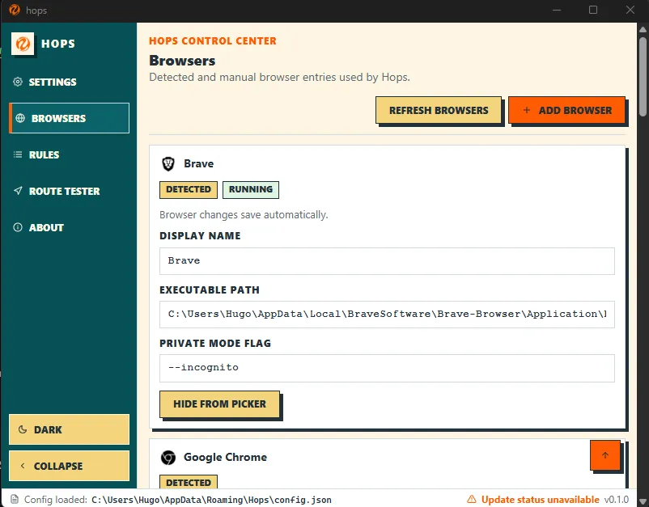
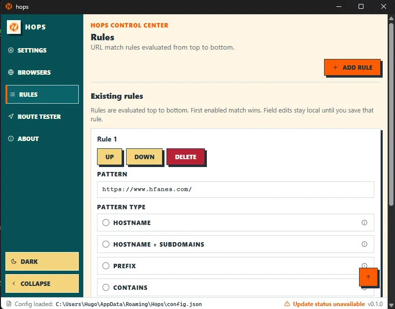
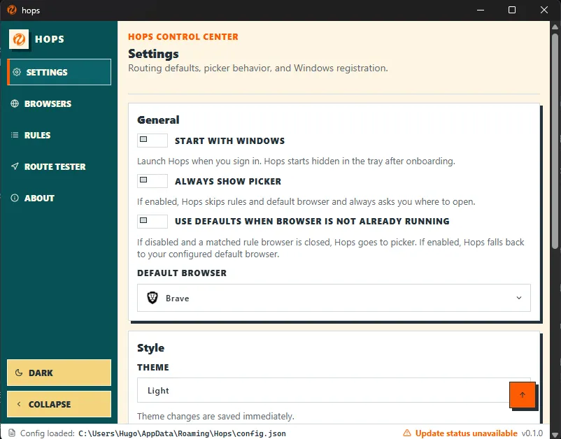
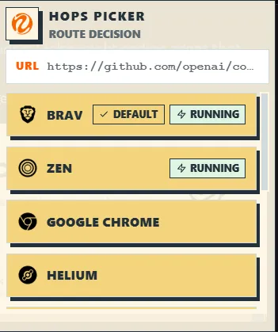

<p align="center">
  
</p>

<h1 align="center">Hops</h1>

<p align="center">
  A Windows tray app that routes external links to the right browser based on your rules.
</p>

<p align="center">
  <a href="https://hops.hfanes.com/">Website</a>
  ·
  <a href="https://github.com/Hfanes/hops/releases/latest">Download</a>
  ·
  <a href="https://github.com/Hfanes/hops/issues">Issues</a>
</p>

Hops is not a web browser. It receives `http` and `https` URLs, applies your routing rules, and launches your chosen browser.

This is a personal project, use it at your own risk. If Hops helps you, remember to star it, fork it, and use it.

<p align="center">
<a href="https://www.hfanes.com/">About me</a>
  ·
  <a href="https://x.com/hfa_dev">Twitter / X</a>
  ·
  <a href="https://github.com/Hfanes">GitHub</a>
</p>

## Table Of Contents

- [Screenshots](#screenshots)
- [Features](#features)
- [Hotkeys](#hotkeys)
- [Installation](#installation)
- [Routing Logic](#routing-logic)
- [Browser Detection And Manual Browser](#browser-detection-and-manual-browser)
- [Windows Registry Keys Touched](#windows-registry-keys-touched)
- [Development](#development)
- [FAQ](#faq)
- [Pattern Examples](#pattern-examples)
- [License](#license)

## Screenshots

### Browsers



### Rules



### Settings



### Window Picker



## Features

- Route external links to different browsers using rules
- Choose a default fallback browser
- Keep Hops running from the Windows tray
- Start Hops automatically with Windows
- First-run onboarding for browser detection and Windows default-app setup
- Automatic browser detection from Windows registry entries and known install paths
- Add manual browser entries
- Hide browsers from the picker
- Open supported browsers in private mode
- Rule ordering with first-match-wins behavior
- Rule enable / disable toggles
- Pattern types: hostname, hostname + subdomains, prefix, contains, full URL, glob, and regex
- Routing preview and route-and-open test tools
- Picker window when a route needs user input
- Register and unregister Hops in Windows Default Apps
- Check whether Hops is registered for `http` and `https`
- In-app update checks from GitHub Releases

## Hotkeys

- `Ctrl+B`: collapse or expand the settings sidebar
- `Ctrl+Shift` while opening a link through Hops: force the picker instead of automatic routing
- `Alt` in the picker: open supported browsers in private mode
- `Esc` in the picker: close the picker
- `Esc` in dropdown-style settings controls: close the open control

## Installation

1. Download the latest Windows installer from [GitHub Releases](https://github.com/Hfanes/hops/releases/latest).
2. Install Hops.
3. Open Hops and complete onboarding.
4. Click `Register Hops` so Windows lists Hops as a browser/default-app option.
5. Open Windows Default Apps and set both `http` and `https` to Hops.
6. Optionally enable `Start with Windows`.

Windows only sends external `http` and `https` link clicks to the current default app handler. If Hops is not selected as the default handler, apps like Discord, Slack, terminals, and email clients will bypass Hops.

## Routing Logic

Hops evaluates URLs in this order:

1. If `Always show picker` is enabled, open the picker.
2. Find the first enabled matching rule.
3. If the rule browser is running, open the URL in that browser.
4. If the rule browser is not running and `Use defaults when browser is not already running` is enabled, use the configured default browser.
5. If there is no usable rule target, use the configured default browser when allowed.
6. Otherwise, open the picker.

The picker opens near the cursor when Hops needs user input. It prioritizes the matched rule browser, then the default browser, then running browsers.

## Browser Detection And Manual Browser

Hops detects browsers from Windows registry entries and common install locations. It supports mainstream Chromium, Firefox, Edge, and Opera variants, plus browsers such as Brave, Vivaldi, LibreWolf, Waterfox, Floorp, Zen, Arc, Helium, and Tor Browser.

Detected browsers and manual browsers are merged into one list. If a manual browser points to the same executable path as a detected browser, the manual entry wins and the detected duplicate is suppressed.

Manual browser entries are validated before Hops launches them:

- `verified`: the executable is recognized as a known browser or recognized browser family
- `user confirmed`: the executable is unknown, but you explicitly approved it once

Hops constrains private-mode flags for recognized browser families:

- Chromium-family browsers use `--incognito`
- Firefox-family browsers use `--private-window`
- Microsoft Edge uses `--inprivate`
- Opera uses `--private`
- Tor Browser does not get an extra private-mode flag injected

Unknown executables can be added manually after confirmation, but Hops does not accept arbitrary custom private-mode flags for them.

## Windows Registry Keys Touched

Hops writes registration under `HKCU` for the current user, so admin rights are not required and rollback is local to your user profile.

When clicking `Register Hops`, the app writes:

- `HKCU\Software\Classes\HopsURL`
- `HKCU\Software\Classes\HopsHTML`
- `HKCU\Software\Classes\Hops`
- `HKCU\Software\Hops\Capabilities`
- `HKCU\Software\RegisteredApplications` value `Hops=Software\Hops\Capabilities`

This does not automatically force Windows defaults. You still choose Hops in Windows Default Apps for `http` and `https`.

To rollback:

1. In Windows Default Apps, switch `http` and `https` away from Hops.
2. In Hops Settings, click `Unregister Hops`.

`Unregister Hops` removes the keys listed above from `HKCU`.

## Development

Requirements:

- [Bun](https://bun.sh/)
- Rust stable
- Windows for the full desktop/default-app behavior

Install dependencies:

```powershell
bun install
```

Run the Tauri app:

```powershell
bun run tauri dev
```

Build the frontend:

```powershell
bun run build
```

Check the Rust app:

```powershell
cargo check --manifest-path src-tauri\Cargo.toml
```

`bun run tauri dev` runs under a terminal-owned dev process. Validate no-console-window behavior with a packaged build, not only dev mode.

## FAQ

### Is Hops a browser?

No. Hops is a link router. It receives URLs from Windows, applies your rules, and opens another browser.

### Why does Hops need to be selected in Windows Default Apps?

Windows only forwards external `http` and `https` links to the current default handler. Hops must be selected there before it can route links from other apps.

### Does Hops require admin rights?

No. Hops registers itself under `HKCU`, the current-user registry hive.

### Can I undo the Windows integration?

Yes. Change `http` and `https` defaults away from Hops in Windows Default Apps, then click `Unregister Hops` in Hops Settings.

### What happens if the target browser is closed?

If `Use defaults when browser is not already running` is enabled, Hops uses your configured default browser. Otherwise, it opens the picker.

### Where is the config stored?

Hops stores its config at `%APPDATA%\Hops\config.json`.

## Pattern Examples

| Pattern type          | Pattern                                | Example match                             | Notes                                    |
| --------------------- | -------------------------------------- | ----------------------------------------- | ---------------------------------------- |
| Hostname              | `github.com`                           | `https://github.com/org/repo`             | Matches the exact hostname only.         |
| Hostname + subdomains | `*.notion.so`                          | `https://workspace.notion.so/page`        | Matches subdomains, not the root domain. |
| Prefix                | `https://linear.app/myteam`            | `https://linear.app/myteam/issue/ENG-1`   | Good for routing one URL branch.         |
| Contains              | `figma`                                | `https://www.figma.com/file/123`          | Can match more than expected.            |
| Full URL              | `https://app.example.com/a`            | `https://app.example.com/a`               | Exact full-string match only.            |
| Glob                  | `https://jira.*/browse/ENG-*`          | `https://jira.example.com/browse/ENG-123` | Supports wildcard matching.              |
| Regex                 | `^https?://(www\.)?youtube\.com/watch` | `https://youtube.com/watch?v=abc`         | Most flexible, easiest to misuse.        |

## License

Hops is licensed under the MIT License. See [LICENSE](LICENSE).
